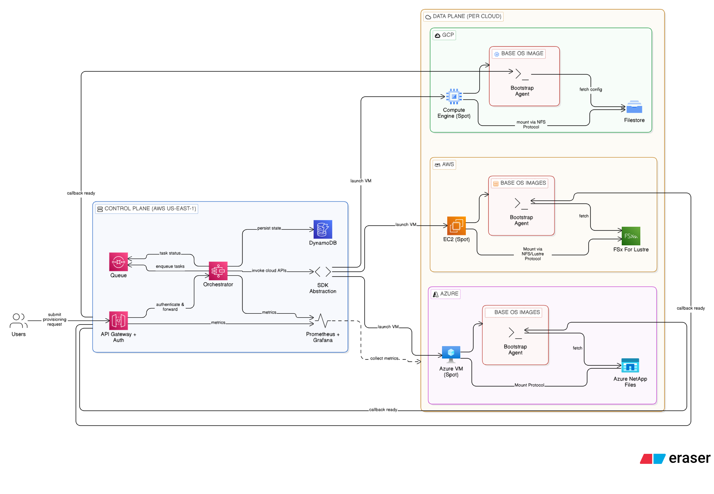

# Multi-Cloud-JIT-Rendering-Platform-

**A scalable, cost-optimized multi-cloud infrastructure for on-demand provisioning of 3D rendering environments.**

This project presents a production-grade architecture that allows users to dynamically provision 1 to 10,000 VMs with specific software (Maya, 3ds Max) + render engine (Arnold, Redshift, V-Ray) combinations across **AWS, GCP, and Azure** — **without maintaining 150+ golden images**.

---

### Highlights

- **Multi-Cloud Ready**: Full support for AWS, GCP, and Azure with thin abstraction layer
- **Sub-5-Minute Provisioning**: Achieved through Just-In-Time (JIT) configuration
- **Zero-Download Workflow**: Thin base images + high-speed network mounts
- **Massive Cost Saving**: Eliminates 150+ VM images and uses Spot Instances by default
- **Zero Egress/Ingress Charges**: All software assets stay inside the target cloud
- **Highly Scalable**: Designed to handle 50+ concurrent users and up to 1,000 VMs

---

### Architecture Overview

**Core Principle**: Just-In-Time (JIT) Configuration

- One **thin base OS image** per cloud (with pre-installed GPU drivers)
- Regional high-performance shared storage:
  - **AWS** → FSx for Lustre
  - **GCP** → Filestore (NFS/Lustre protocol)
  - **Azure** → Azure NetApp Files
- Bootstrap Agent reads instance metadata → mounts required software → sets environment variables → sends READY callback

---

### Key Design Decisions

- Dynamic provisioning without per-combination golden images
- DynamoDB-backed compatibility matrix for software + plugin validation
- Metadata-driven Bootstrap Agent for zero manual intervention
- Spot-First compute strategy with fallback to on-demand
- Centralized shared library for instant version updates

---

### Technology Stack

- **Clouds**: AWS, GCP, Azure
- **Orchestration**: Serverless (Step Functions / Cloud Workflows)
- **Storage**: FSx for Lustre, Filestore, Azure NetApp Files
- **Compute**: Spot Instances / Spot VMs
- **Configuration**: Instance Metadata + Bootstrap Agent
- **Monitoring**: Prometheus, Grafana, CloudWatch

---

### Documents

- **[Full Architecture Design Document](assignment-multicloud-aryan-katiyar.pdf)**
- **[High-Level Architecture Diagram](diagram-export-3-26-2026-3_14_48-PM.png)**

---

### Why This Project Matters

This architecture showcases real-world cloud engineering skills in:
- Multi-cloud system design
- Cost optimization at scale
- High-performance shared storage patterns
- Just-In-Time environment configuration
- Reliability and observability principles

Built as a **conceptual DevOps / Cloud Engineering portfolio project** to demonstrate modern infrastructure thinking.

---

**Made with ❤️ for learning and portfolio purposes**

